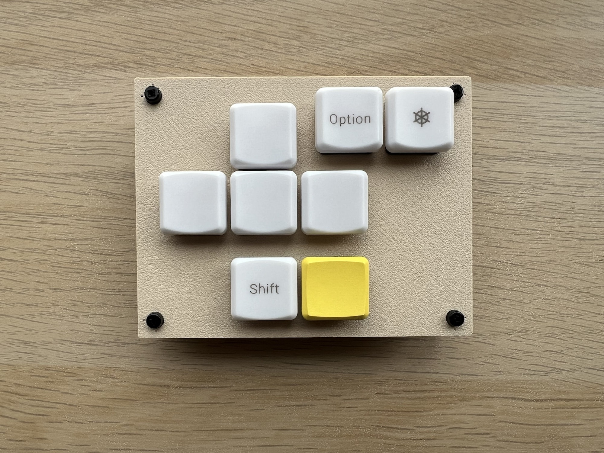
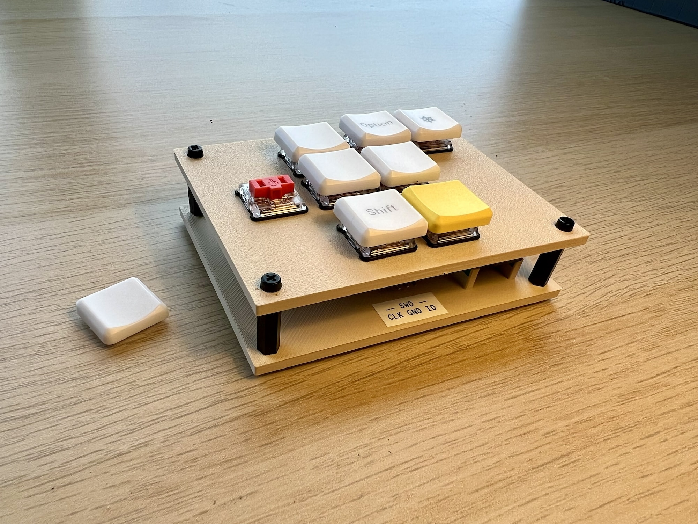
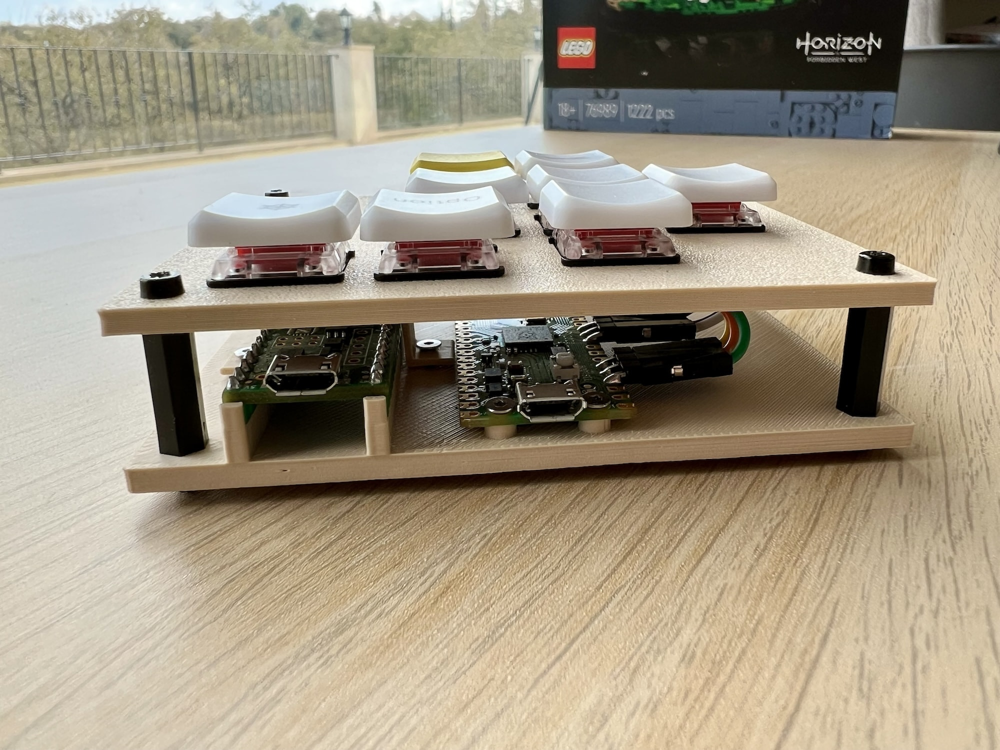
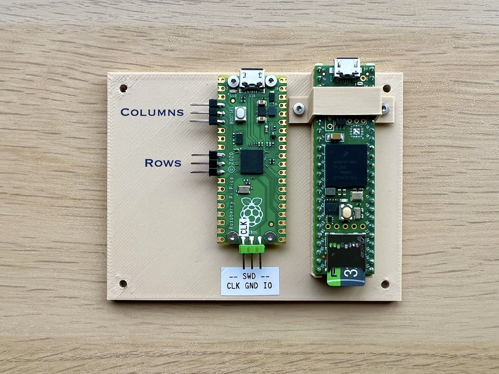
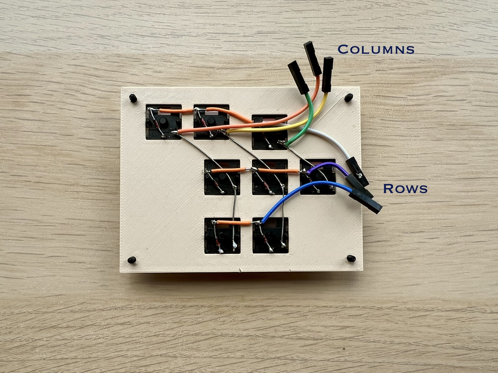

# M8-kbd

USB keypad designed for use with the [M8 Headless](https://github.com/Dirtywave/M8HeadlessFirmware). The layout is inspired by the original [Dirtywave M8 tracker](https://dirtywave.com/).

Not a replacement for the original hardware, but something I put together with spare parts as a way to get hands-on experience with the M8.

Features:

- 3x3 handwired keyboard matrix (1N4148 diodes)
- Kailh Choc V1 switches ([datasheet](https://cdn-shop.adafruit.com/product-files/5113/CHOC+keyswitch_Kailh-CPG135001D01_C400229.pdf)), mounted in 13.85x13.85 square holes
- [Raspberry Pico](https://datasheets.raspberrypi.com/pico/pico-datasheet.pdf) as the keyboard controller
- Firmware in Rust, based on [rp2040-hal](https://github.com/rp-rs/rp-hal-boards/tree/main/boards/rp-pico), [RTIC v1](https://rtic.rs/1/book/en/) and [Keyberon](https://github.com/TeXitoi/keyberon)
- Supports both [m8.run](https://m8.run) and [m8c](https://github.com/laamaa/m8c) keymaps and special functions (see below)
- Bottom plate also has a mount for [Teensy 4.1](https://www.pjrc.com/store/teensy41.html) (with headers) which runs M8 Headless.
 

### Keymap

When you press a key, the keyboard sends a code to the host running the [M8 display client](https://github.com/DirtyWave/M8Docs/blob/main/docs/M8HeadlessSetup.md#software). The key code sent depends on the keymap that has been selected.

##### Keymap #1 (for use with [m8.run](https://m8.run))

| Key code | M8 function |
|----------|-------------|
| Arrows   | Arrows      |
| `Shift`  | Shift       |
| `Space`  | Play        |
| `Z`      | Option      |
| `X`      | Edit        |

##### Keymap 2 (for use with [m8c](https://github.com/laamaa/m8c)):

| Key code | M8 function |
|----------|-------------|
| Arrows   | Arrows      |
| `Shift`  | Shift       |
| `Space`  | Play        |
| `A`      | Option      |
| `S`      | Edit        |

The combination of pressing `Left` and `Down` *simultaneously* acts as the `Fn` key for invoking special functions. Press `Left` and `Down` together as the piano chord, and then add the desired key to activate the function.

- `Fn` + `Right`: Toggle between keymaps. The current keymap number is stored in flash memory.
- `Fn` + `Play`: Perform a firmware reset.
- `Fn` + `Edit`: Enter UF2 bootloader mode.

### Install and update

The easiest method is to use [UF2](https://github.com/microsoft/uf2):

- download UF2 file from [Releases](https://github.com/kolontsov/m8-kbd/releases)
- press and hold the BOOTSEL button while connecting your Pico to your computer; it will mount as a mass storage device
- drag and drop UF2 file onto the board drive

In the future, you can activate UF2 mass-storage mode by pressing `Fn` + `Edit`, eliminating the need to use the BOOTSEL button.

For development, using the SWD (Serial Wire Debug) interface is much more convenient. You only need 3 wires: SWDCLK, GND and SWDIO. Connect a [Raspberry Pi Debug Probe](https://www.raspberrypi.com/documentation/microcontrollers/debug-probe.html) (which is just Pico with [picoprobe firmware](https://github.com/raspberrypi/picoprobe)) and run `make` in the M8-kbd directory. It will use [probe-rs](https://probe.rs/) to do the actual job.

